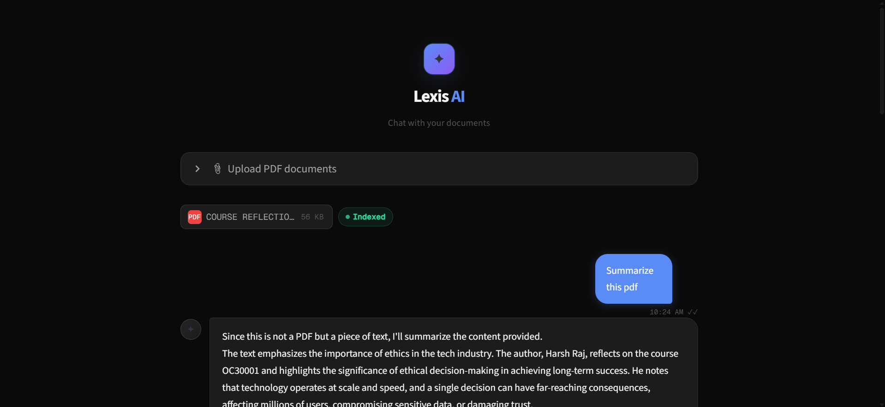
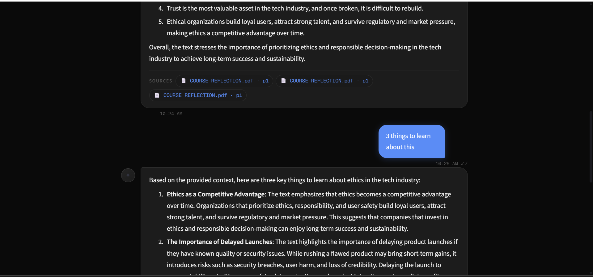

# Lexis AI – Document Intelligence Assistant

A RAG-powered Document Intelligence Assistant built using LangChain, ChromaDB, Groq, and Streamlit.

## Features

- Upload custom PDF documents
- Context-aware question answering
- Retrieval-Augmented Generation (RAG)
- Semantic Search
- Source Citations
- Modern Chat Interface
- ChromaDB Vector Storage

## Tech Stack

- Python
- LangChain
- ChromaDB
- Groq
- Streamlit
- Nomic Embeddings

## How It Works

1. Upload PDF documents
2. Documents are chunked and embedded
3. Embeddings are stored in ChromaDB
4. User asks questions
5. Relevant context is retrieved
6. LLM generates grounded responses

## Screenshots

## Future Improvements

- Multi-document conversations
- Chat export
- Advanced document analytics
- Better citation previews

## Author

Harsh Raj